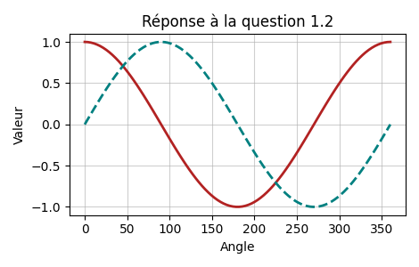

# Outils Numériques / Semestre 5

Ce dépôt regroupe l'ensemble des documents nécessaires au module **Outils Numériques** proposés aux futur.es ingénieur.es de SupOptique, semestre 5.

Developpé par Julien VILLEMEJANE / **[LEnsE](http://lense.institutoptique.fr)** / [Institut d'Optique Graduate School](https://www.institutoptique.fr) / France

*Projet en cours de développement. Mise en place prévue en janvier 2024.*

## Comment utiliser ce dépôt

Vous pouvez télécharger l'ensemble du dépôt à l'aide de l'icône **CODE**, puis **Download ZIP**. Décompressez ensuite l'archive sur votre ordinateur.

Le dépôt regroupe les ressources suivantes :
- **ONIP** : répertoire contenant les ressources nécessaires au module **Outils Numériques pour l'Ingénieur en Physique**
  - ***b0_intro*** : objectifs du module d'apprentissage et déroulement 
  - ***b1_methodes_numeriques*** : premier bloc d'apprentissage autour des méthodes numériques
    - découverte par l'exemple et diaporamas sur les notions importantes
    - *notions abordées* : bases du langage Python, résolution d'équations linéaires, résolutions d'équations différentielles par 3 approches : symboliques, intégration numérique (Euler) et système (automatique)
  - ***b2_traitement_1D*** : second bloc d'apprentissage autour des signaux 1D et traitements basiques (FFT)
    - découverte par le projet : acquisition d'un signal modulé en amplitude à démoduler
    - *en cours de développement*
  - ***b3_traitement_2D*** : troisième bloc d'apprentissage autour des images 2D et traitements basiques (coupe, FFT, régression)
    - découverte par le projet : images provenant d'un faisceau LASER gaussien à analyser
    - *en cours de développement*
- **CeTI** : *à venir...*

Les exemples fournis dans ce dépôt se basent sur une version supérieure à 3.7 de **Python**.

## Pour débuter

Rendez-vous dans la section ***b0_intro*** et ouvrez le document **B0_0_Outils_Methodes.pdf** !

Chaque bloc regroupe ensuite des documents numérotés dans l'ordre de traitement...

## Déroulement des séquences d'apprentissage

Ce module est prévu pour s'étaler sur 12 séances de 2h, sur machine.

Chaque bloc est prévu pour 4 séances.

Pour débuter
Rendez-vous dans la section b0_intro et ouvrez le document B0_0_Outils_Methodes.pdf !

Chaque bloc regroupe ensuite des documents numérotés dans l'ordre de traitement...

Déroulement des séquences d'apprentissage
Ce module est prévu pour s'étaler sur 12 séances de 2h, sur machine.

Chaque bloc est prévu pour 4 séances.


## Illustration et explication de la grille d'évaluation

### Méthodes numériques
#### Ecriture Matricielle / Vectorielle
Votre code doit être optimisé et pour cela bannir au maximum les boucles *for*. Par exemple, pour construire un vecteur, utilisez la bibliothèque `numpy` plutôt que des listes construites par compréhension. Par exemple, supposons que nous voulons créer un vecteur allant de 0 à 399, le code 1 ci-dessous utilise un fonction vectorisée de `numpy` environ 20 fois plus rapide que celle du code 2 qui construit la liste par compréhension. Le code 3 est bien évidemment à proscire absolument : on crée un objet vide dont on va augmenter la taille à chaque itération de la boucle *for*. La mémoire ré-allouée change à chaque itération ce qui est sous-optimal. 
##### Code 1 :smile: 
``` python
import numpy as np
x = np.arange(400)
```
##### Code 2 :disappointed:
``` python
x = [i for i in range(400)]
```
##### Code 3 :scream:
``` python
x = []
for i in range(400):
    x.append(i)
```
#### Organisation en actions élémentaires
Votre code doit être décomposé en plusieurs blocs et plusieurs fonctions. 


#### Description des tests de validation
To do.


#### Organisation des informations à traiter

To do.


### Programmation

#### Ecriture et commentaires (PEP 8)

La [norme PEP 8 (Python Enhancement Proposals 8)](https://peps.python.org/pep-0008/) est un guide de style pour la rédaction de code Python.  Elle fournit des recommandations sur la manière de structurer le code, d'organiser les espaces, de nommer les variables, de commenter le code, et d'autres aspects de la programmation Python. Par exemple, dans les codes 1 et 2 ci-dessous : 
* les imports se font en haut du document et jamais au milieu du code,
* les noms des variables et des fonctions sont explicites, en minuscules, avec des underscores pour séparer les mots. Les variables commençant par des majuscules sont réservées aux classes qui seront abordées plus tard dans le cours.
* utilisez des commentaires pour expliquer le code complexe. Mais *évitez les commentaires évidents*.
* utilisez des docstrings pour documenter les modules, classes, fonctions et méthodes. Voir la partie *Documentation des fonctions* pour plus d'informations.


Vous pouvez lire toute la documentation et respecter scrupuleusement ces règles... ou bien installer `autopep8`[^autopep] et configurer spyder pour formatter automatiquement votre code. Vous pouvez aussi installer un formatteur (flake8, black, yapf) afin de formatter votre code à chaque enregistrement.
[^autopep]: pour l'installer : `pip install autopep8`

##### Code 1 :smile:
``` python
import numpy as np
import math

def addition(input_1, input_2):
    """
    Fonction qui fait la somme de deux array-like objects.
    Parameters
    ----------
    input_1 : np.array
        premier terme de l'addition
    input_2 : np.array
        second terme de l'addition

    Returns
    -------
    np.array
        somme des deux arguments de la fonction
    """
    result = input_1 + input_2
    return result

x = np.arange(10)
y = np.sin(x)
print(addition(x, y))
```

##### Code 2 :scream:
``` python
def Addition(InputUn, InputDeux):
    # Cette fonction additionne deux nombres
    RESULT = InputUn + InputDeux # je fais l'addition des deux nombres et je raconte ma vie ce qui fait que ma ligne est beaucoup beaucoup trop grande
    return RESULT

import numpy as NP
import math

x = NP.arange(10)
y = math.sin(x)

print(Addition(x, y))
```


#### Utilisation, écriture et validation de fonctions
Ne codez pas tout d'un bloc et utilisez des fonctions ! De plus, ne faîtes pas des fonctions trop longues mais découpez les en plusieurs sous-fonction que vous imbriquez les unes dans les autres. 

##### Code 1 :smile:
``` python
def gaussian(x, offset, A, sigma, x0):
    """insert documentation here."""
    return offset + A * np.exp(-(x - x0)**2 / (2 * sigma**2) )
x = np.linpsace(-8, 8, 100)
plt.plot(x, gaussian(x, A = 10, sigma = 2, x0 = 1))
```

##### Code 2 :scream:
``` python
x = np.linpsace(-8, 8, 100)
plt.plot(x, 1 + 10 * np.exp(-(x - 1)**2 / (2 * 2**2) ))
```


#### Documentation des fonctions (PEP257)
La [norme PEP 257](https://peps.python.org/pep-0257/) fait référence aux conventions de documentation pour python. N'hésitez pas à jeter un coup d'oeil ou à vous intéresser aux *bonnes pratiques*. Le PEP 257, en particulier, concerne les conventions pour la documentation des chaînes de documentation (docstrings).

##### Code 1 :smile:
``` python
def squared_and_message(x, msg):
    """Formidable fonction qui renvoie le carré du vecteur x donné 
    en argument après avoir affiché le second argument de la fonction.

    Parameters
    ----------
    x : np.array
        Vecteur/matrice à mettre au carré
    msg : str
        chaîne de charactères à afficher

    Returns
    -------
    np.array
        Le vecteur/matrice x mis au carré
    """
    print(msg)
    return np.array(x)**2
```
##### Code 2 :disappointed:
``` python
def squared_and_message(x, msg):
    '''renvoie le carré de x et affiche le message.'''
    print(msg)
    return np.array(x)**2
```

##### Code 3 :scream:
``` python
def squared_and_message(x, msg):
    print(msg)
    return np.array(x)**2
```

##### :bulb: Tirez partie de Spyder !
Si vous utilisez Spyder (ou un autre IDE tel que PyCharm ou VSCode, par exemple), les docstrings des fonctions peuvent être auto-complétées selon un format spécifique. Vous n'avez qu'à ajouter trois guillemets triples ("""") sous votre fonction et appuyer sur "Entrée" lorsque Spyder vous propose de générer la documentation.


Pour aller encore plus loin, vous pouvez définir vos fonctions comme ci-dessous. En spécifiant le type de chaque argument, celui-ci sera automatiquement documenté. [^docstring_foot_note]

[^docstring_foot_note]:Ces annotations de types ne facilitent pas seulement la complétion des docstrings, mais elles rendent également votre code plus lisible. De plus, elles permettent de vérifier votre code à l'aide d'outils externes tels que Mypy pour détecter d'éventuelles erreurs de type avant l'exécution du programme.

``` python
def squared_and_message(x:np.array, msg:str)->np.array:
```

#### Utilisation de bibliothèques
Tirez partie des différents modules python et ne cherchez pas à tout recoder par vous même. En revanche, nous vous demandons de comprendre les fonctions que vous utilisez. Par exemple, nul besoin de re-coder une fonction qui fait un ajustement de courbe, utilisez la méthode *curve_fit* de scipy. Néanmoins renseignez-vous un minimum sur les arguments que prend la fonction en entrée et ce qu'elle retourne. Cela peut-être bien également d'avoir une petite idée de *comment* la fonction utilisée procède afin de mettre le doigt sur des problèmes de convergence. Par exemple, la fonction *curve_fit* de scipy peut avoir du mal à ajuster votre modèle sur les données expérimentales si vous ne lui donnez pas des paramètres suffisamment proches de l'optimisation (voir même aucun paramètres comme dans le code 2 !). 

##### Code 1 :smile:
``` python
# -- do guess for the fit 
barycenter_x = get_barycenter(data_x) # center 
sigma = np.sqrt(np.abs(np.mean(data_x*(x - barycenter_x)**2)))/4 # width
p0 = [np.min(data_x), # offset
      np.max(data_x) - np.min(data_x), # amplitude
      sigma,
      barycenter_x,
     ]
popt, pcov = curve_fit(gaussian, x , data_x, p0 = p0)
```
##### Code 2 :disappointed:
``` python
popt, pcov = curve_fit(gaussian, x , data_x)
```

#### Ecriture et validation d'une bibliothèque
To do.

### Ingénieur·e physique
#### Graphiques pertinents et légendés
Le titre de cette section est certainement assez clair mais *mettez des titres à vos axes et legendez vos courbes* ! Par ailleurs, évitez les titres scolaires et qui n'évoquent rien comme celui de la figure 2 ci-dessous :wink:. 
##### Figure 1 :smile:


##### Figure 2 :disappointed:


##### Figure 3 :scream:


#### Génération de données pertinentes de tests
To do.

#### Analyse des données et validation modèle
Vous êtes physicien·ne·s : est-ce que ce que vous testez / présentez a vraiment un sens physique. Quels sont les unités des quantités que vous utilisez ? 


